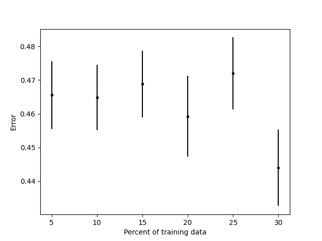
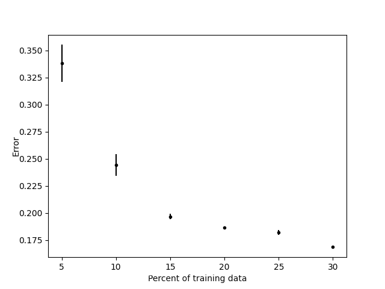

# TO VIEW THE RENDERED LATEX EQUATIONS SEE PDF IN REPO
I didn't realize that Github did not render equations enclosed in $$

# How to run program:
```
$ python main.py
>> Filename?
spambase.data
>> num_splits? (int)
100
>> train_percent? (in the form of "x,x,x")
5,10,15,20,25,30
```
The dataset must be in the form:
|$x_1$|$x_2$|...|$x_n$|$y$|
|- |- |- |- |-|
|$\vdots$ |$\vdots$ |$\vdots$ |$\vdots$ |$\vdots$ |

Where x's can be floats and integers, and y's are only binary values (0s or 1s).

# Question 1:
Optimal function mapping that:
$$
\begin{align*}
\min_{f(\cdot)}
\mathbb{E}_{x,y}
[J(f(x), y)]
&=
\min_{f(\cdot)}
\int_x \int_y
J(f(x), y)
\cdot
P(x,y)
dxdy
\\

&=
\min_{f(\cdot)}
\int_x \int_y
J(f(x), y)
\cdot
P(y|x)P(x)
dxdy
\\

&=
\min_{f(\cdot)}
\int_x
\left\{
\int_y
J(f(x), y)
\cdot
P(y|x)
dy
\right\}
P(x)
dx
\end{align*}
\\
\text{Find a the optimal function } f(x) \text{ for any given x}
\\
z=f(x)
\\

\begin{align*}
\min_{f(\cdot)}
\mathbb{E}_{x,y}
[J(f(x), y)]
&\cong
\min_{z}
\int_y
J(z, y)
\cdot
P(y|x)
dy
\\

&\cong
\min_{z}
\int_y
(z-y)^2
\cdot
P(y|x)
dy
\\
\text{Take the gradient }
& \quad

\frac{\delta}{\delta z}
\int_y
(z-y)^2
\cdot
P(y|x)
dy
=0
\\

& \quad
\int_y
2(z-y)
\cdot
P(y|x)
dy
=0
\\

& \quad
\int_y
z
P(y|x)
dy
=
\int_y
y
P(y|x)
dy
\\

& \quad
z
=
\mathbb{E}[y|x]
\\
\end{align*}
$$
$$
\therefore
f(x)=z=\mathbb{E}[y|x]
\text{ is the optimal function}
$$


# Question 2:
## a) Summary of methods and results
$$
N = \text{ Number of datums} \\
d = \text{ Number of features} \\
\alpha = \text{ Learning rate} \\
p = \text{ Percentage of current split} \\
$$

### Logistic Regression


LMS update using batch GD was used for logisitic regression:
$$
\underline{\theta}^{(k+1)}
=
\underline{\theta}^{(k)}
-
\frac{\alpha}{Np}
\sum_{n=1}^{Np}
\nabla J_n(\underline{\theta})
\quad\quad
\underline{\theta} \in\mathbb{R}^d 
$$

$$
\nabla J_n(\underline{\theta})
=
\left[
\begin{matrix}
\frac{\delta}{\delta \underline{\theta}_0}
J(\underline{\theta}_0) \\

\frac{\delta}{\delta \underline{\theta}_1}
J(\underline{\theta}_1) \\

\vdots \\

\frac{\delta}{\delta \underline{\theta}_d}
J(\underline{\theta}_d)
\end{matrix}
\right]
$$

$$
\frac{\delta}{\delta \underline{\theta}_i}
J(\underline{\theta}_i)
=
(
\sigma(\underline{\theta}_i^T\underline{X}_n)
-
y_n
)
\underline{X}_n
$$

The results from the testing data with parameters
```python
num_splits = 100
train_percent = [5, 10, 15, 20, 25, 30]
epochs/iterations = 350
```


Conclusion: the dataset cannot be represented better by the linear logistic model. Kernel method may produce better results.

### Naive Bayers

$$
P(y | \underline{x})
\propto
P(\underline{x}|y)
P(y)
$$
Under the assumption of Naive Bayes where all features in $\underline{x}$ are i.i.d.:
$$
P(\underline{x}|y) = 
\prod_{i=1}^{d}
\frac{1}{\sqrt{(2\pi)\sigma_{i,y}^2}}
\exp\left(
-\frac{ (x_{i}-\mu_{i,y})^2}{2\sigma_{i,y}^2} 
\right)
\quad\quad

P(y)
=
\frac{
  \sum_{n=1}^{Np}
  \mathbb{1}\{y_n=1\}
}
{
  Np
}
$$
when $\sigma_y = 0$, it is set to $0.00001$ to avoid divide-by-zero errors.

To calculate the mean and variance for each feature:
$$
\underline{\mu_y}
=
\left[
\begin{matrix}
\mu_{1,y} \\
\mu_{2,y} \\
\vdots \\
\mu_{d,y}
\end{matrix}
\right]
=
\frac{
  \sum_{n=1}^{Np}
  \mathbb{1}\{y_n=y\}
  \underline{X}_n
}
{
  \sum_{n=1}^{Np}
  \mathbb{1}\{y_n=y\}}
$$

$$
\underline{\sigma_y}
=
\left[
\begin{matrix}
\sigma_{1,y} \\
\sigma_{2,y} \\
\vdots \\
\sigma_{d,y}
\end{matrix}
\right]
=
\frac{
  \sum_{n=1}^{Np}
  \mathbb{1}\{y_n=y\}
  (\underline{X}_n
  -
  \underline{\mu}_{y}
  ) ^2
}
{
  \sum_{n=1}^{Np}
  \mathbb{1}\{y_n=y\}}
$$


The results from the testing data:



## b) Code:
The code can be found on Github:

[https://github.com/DeBestTrap/Intro-to-Machine-Learning/tree/main/HW3](https://github.com/DeBestTrap/Intro-to-Machine-Learning/tree/main/HW3)

Specifically for logistic regression:

[https://github.com/DeBestTrap/Intro-to-Machine-Learning/blob/main/HW3/logistic_reg.py](https://github.com/DeBestTrap/Intro-to-Machine-Learning/blob/main/HW3/logistic_reg.py)

Specifically for Naive Bayes:

[https://github.com/DeBestTrap/Intro-to-Machine-Learning/blob/main/HW3/nb.py](https://github.com/DeBestTrap/Intro-to-Machine-Learning/blob/main/HW3/nb.py)

Specifically for the testing and displaying of data:

[https://github.com/DeBestTrap/Intro-to-Machine-Learning/blob/main/HW3/main.py](https://github.com/DeBestTrap/Intro-to-Machine-Learning/blob/main/HW3/main.py)
