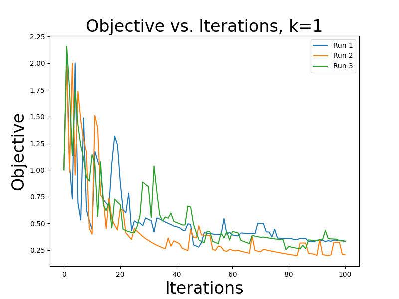

This homework implements the Pegasos algorithm from [Pegasos: Primal Estimated sub-GrAdient SOlver for SVM](https://github.com/DeBestTrap/Intro-to-Machine-Learning/blob/main/HW4/files/pegasos.pdf) on the [MNIST-13](https://github.com/DeBestTrap/Intro-to-Machine-Learning/blob/main/HW4/MNIST-13.csv) dataset.

How to use:
```None
python mysgdsvm.py filename k numruns

params
------
  filename: filename of the dataset
  k: the minibatch size
  numruns: number of runs

optional flags
--------------
  --plot: plots the data and shows it
  --results: run the same k's as in the "Summary and Results" section.
    When using this flag, the k argument is not used but still must 
    be included.
```

## Example:
Runs pegasos 2 times and output the avg runtime and std.
```None
python mysgdsvm.py "MNIST-13.csv" 5 2 --plot
```

## Example:
Runs pegasos 3 times, output the avg runtime and std, and shows the plot of Objective Value vs. Iterations.
```None
python mysgdsvm.py "MNIST-13.csv" 1 3 --plot
```
Yields:



## Example:
Runs pegasos 5 times, output the avg runtime and std, and shows the plot of Objective Value vs. Iterations for `k = [1, 20, 100, 200, N]` (plot for the "Summary and Results" section):
```None
python mysgdsvm.py "MNIST-13.csv" ___ 5 --plot --results
                                  ^^^
                          This arg can be anything
                              it is ignored
```
Yields:


