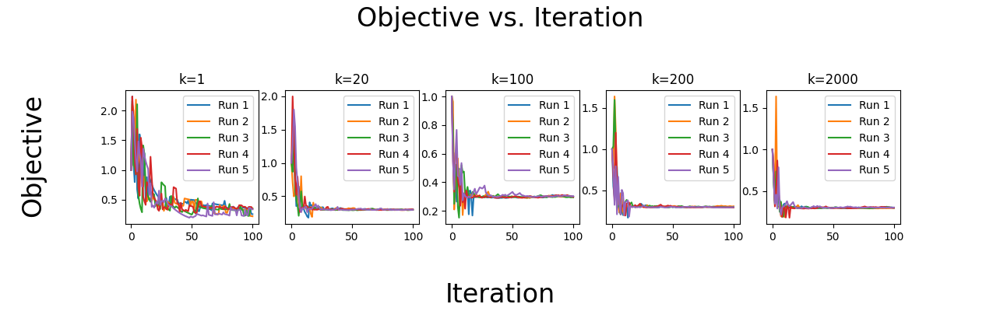
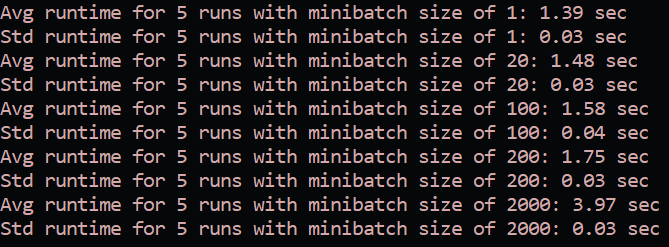

This homework implements the Pegasos algorithm from [Pegasos: Primal Estimated sub-GrAdient SOlver for SVM](https://github.com/DeBestTrap/Intro-to-Machine-Learning/blob/main/HW4/files/pegasos.pdf) on the [MNIST-13](https://github.com/DeBestTrap/Intro-to-Machine-Learning/blob/main/HW4/MNIST-13.csv) dataset.

How to use:
```
python mysgdsvm.py filename k numruns

params
------
  filename: filename of the dataset
  k: the minibatch size
  numruns: number of runs

optional flags
--------------
  --plot: plots the data and shows it
  --results: run the same k's as in the "Summary and Results" section.
    When using this flag, the k argument is not used but still must 
    be included.
```

Example, shows the plot for the "Summary and Results" section:
```
python mysgdsvm.py "MNIST-13.csv" 1 5 --plot --results
```


# Q1
<!-- ## a)
### Symmetry
### Positive Semi-Definite

## b)
### Symmetry
### Positive Semi-Definite

## c)
### Symmetry
### Positive Semi-Definite

## d)
### Symmetry
### Positive Semi-Definite
 -->
## a)
### Symmetry
### Positive Semi-Definite

## b)
### Symmetry

<!--  -->

<div align="center">  </div>

Since $K_1$ and $K_2$ are valid kernel functions,

<div align="center">  </div>

<div align="center">  </div>
$\therefore$ K is symmetric.

### Positive Semi-Definite

## c)
### Symmetry
### Positive Semi-Definite

## d)
### Symmetry
### Positive Semi-Definite

# Q2

## Summary and Results
```
max_iter = 100
lambda = 1e5
```



## Code
Code and README can be found on Github.

